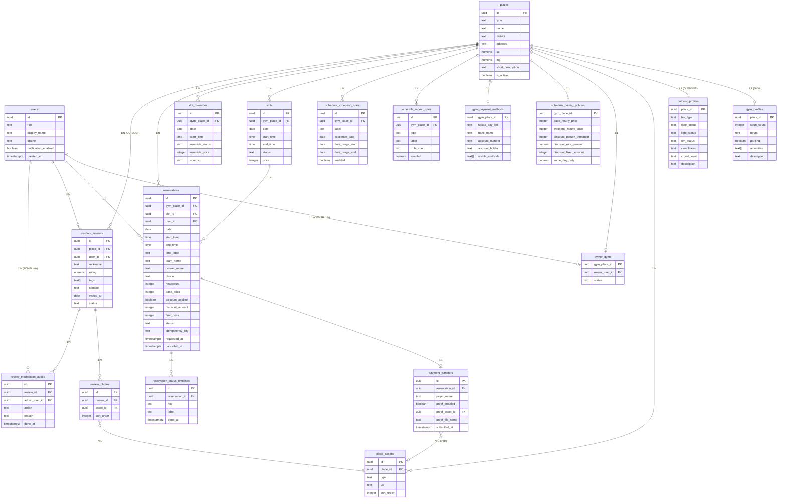

# ERD.md — 부산 농구 공간 플랫폼 DB 설계 (Entity Relationship Diagram)

> **기준 문서**: `BACKEND_DATA_IA.md`, `PRD_V2.md`, `FRONT_PROMPT_V3.md`
> **DB 타겟**: Supabase (PostgreSQL)
> **작성일**: 2026-03-30

---

## 0. 라우터 ↔ BACKEND_DATA_IA 매핑 검토

### 0-1. 실제 프론트 라우터 (App.tsx 기준)

| 프론트 경로 | 컴포넌트 | 대응 IA 라우터 | 상태 |
|---|---|---|---|
| `/` | `Home` | `"/"` (home.json) | ✅ 매핑 |
| `/login` | `Login` | — | ➕ IA 미정의 (인증 라우터) |
| `/signup` | `Signup` | — | ➕ IA 미정의 (인증 라우터) |
| `/busan` | `Busan` | — | ➕ IA 미정의 (지역 소개 페이지, read-only) |
| `/gyms` | `Gyms` | `"/"` 일부 (장소 목록 필터) | ⚠️ IA의 홈 필터와 유사, 별도 페이지로 분리됨 |
| `/gyms/:gymId` | `GymDetail` | `"/place/gym/:id"` (gymDetail.json) | ✅ 매핑 (경로명 차이) |
| `/place/outdoor/:id` | `OutdoorSpotPage` | `"/place/outdoor/:id"` (outdoorDetail.json) | ✅ 매핑 |
| `/checkout` | `Checkout` | `"/booking/:gymId"` + `"/payment/:reservationId"` | ⚠️ 프론트는 booking+payment를 단일 `/checkout`으로 통합 |
| `/success` | `Success` | `"/reservation/:reservationId"` (reservationStatus.json) | ⚠️ 프론트는 `/success`로 단순화, 상태 확인은 마이페이지 |
| `/owner` | `Owner` | `"/owner/dashboard"` + `"/owner/schedule"` | ⚠️ `/owner`와 `/owner/schedule`이 동일 컴포넌트 |
| `/owner/schedule` | `Owner` | `"/owner/schedule"` (ownerSchedule.json) | ✅ 매핑 |
| `/owner/payment-methods` | `OwnerPaymentMethods` | `"/owner/payment-methods"` (ownerPaymentMethods.json) | ✅ 매핑 |
| `/owner/reservations` | `OwnerReservations` | `"/owner/reservations"` (ownerReservations.json) | ✅ 매핑 |
| `/organizer` | `Organizer` | — | ➕ IA 미정의 (장소 데이터 관리자 역할, Ops팀) |
| `/ops` | `Ops` | — | ➕ IA 미정의 (내부 운영 어드민) |
| `/my` | `MyPage` | — | ➕ IA 미정의 (일반 사용자 마이페이지) |
| `/my/profile` | `ProfileEdit` | — | ➕ IA 미정의 (프로필 수정) |
| `/my/notifications` | `NotificationSettings` | — | ➕ IA 미정의 (알림 설정) |
| `/my/terms` | `Terms` | — | ➕ IA 미정의 (약관) |
| `/my/reservations` | `MyReservations` | `"/reservation/:reservationId"` 유사 | ⚠️ IA는 단건, 프론트는 목록 |

### 0-2. 주요 갭 정리

| 항목 | 내용 |
|---|---|
| **경로명 차이** | IA: `/place/gym/:id` → 프론트: `/gyms/:gymId` |
| **통합 체크아웃** | IA: booking + payment 분리 → 프론트: `/checkout` 단일 플로우 |
| **Admin 분리** | IA: `/admin/reviews` → 프론트: `/ops` (Ops 페이지) |
| **마이페이지 목록** | IA: 단건 예약 상태 조회 → 프론트: `/my/reservations`로 목록 |
| **신규 라우터** | `/login`, `/signup`, `/busan`, `/gyms`, `/organizer`, `/my/*` |

> **DB 설계 방향**: IA의 엔티티 정의를 기준으로 하되, 프론트 라우터 갭에서 추가 필요한 테이블/필드를 반영

---

## 1. Enum 타입 정의

```sql
-- 장소 유형
PlaceType: GYM | OUTDOOR

-- 슬롯 상태
SlotStatus: AVAILABLE | CLASS | REGULAR | CLOSED

-- 예약 상태
ReservationStatus:
  REQUESTED | AWAITING_TRANSFER | TRANSFER_SUBMITTED |
  OWNER_VERIFIED | CONFIRMED | CANCELLED

-- 리뷰 상태
ReviewStatus: PENDING | VISIBLE | HIDDEN

-- 사용자 역할
UserRole: USER | OWNER | ADMIN | ORGANIZER | OPS

-- 이미지/에셋 타입
AssetType: GALLERY | THUMBNAIL | REVIEW_PHOTO | PROOF

-- 반복 규칙 유형
RepeatRuleType: CLASS | REGULAR

-- 검수 액션
ModerationAction: HIDE | RESTORE | APPROVE

-- 슬롯 오버라이드 소스
SlotOverrideSource: OWNER_EDIT | SYSTEM_GENERATED

-- 결제 수단 유형
PaymentMethodType: KAKAO | BANK
```

---

## 2. 테이블 정의

### 2-1. `users` — 사용자

> Supabase `auth.users`와 연동. `auth.users.id`를 PK로 참조.

| 컬럼 | 타입 | 제약 | 설명 |
|---|---|---|---|
| `id` | `uuid` | PK, FK → auth.users.id | Supabase Auth ID |
| `role` | `UserRole` | NOT NULL, DEFAULT 'USER' | 역할 |
| `display_name` | `text` | NOT NULL | 표시 이름 |
| `phone` | `text` | NULLABLE | 전화번호 |
| `notification_enabled` | `boolean` | DEFAULT true | 알림 수신 여부 |
| `created_at` | `timestamptz` | NOT NULL, DEFAULT now() | 가입일 |
| `updated_at` | `timestamptz` | NOT NULL, DEFAULT now() | 수정일 |

---

### 2-2. `places` — 장소 (공통)

| 컬럼 | 타입 | 제약 | 설명 |
|---|---|---|---|
| `id` | `uuid` | PK, DEFAULT gen_random_uuid() | 장소 ID |
| `type` | `PlaceType` | NOT NULL | GYM / OUTDOOR |
| `name` | `text` | NOT NULL | 장소명 |
| `district` | `text` | NOT NULL | 구/군 (예: 해운대구) |
| `address` | `text` | NULLABLE | 상세 주소 |
| `lat` | `numeric(10,7)` | NULLABLE | 위도 (지도 핀) |
| `lng` | `numeric(10,7)` | NULLABLE | 경도 (지도 핀) |
| `short_description` | `text` | NULLABLE | 홈 리스트용 한 줄 설명 |
| `is_active` | `boolean` | NOT NULL, DEFAULT true | 활성 여부 |
| `created_at` | `timestamptz` | NOT NULL, DEFAULT now() | |
| `updated_at` | `timestamptz` | NOT NULL, DEFAULT now() | |

---

### 2-3. `gym_profiles` — 실내 체육관 확장 정보

> `places.type = 'GYM'`인 경우 1:1 대응

| 컬럼 | 타입 | 제약 | 설명 |
|---|---|---|---|
| `place_id` | `uuid` | PK, FK → places.id | |
| `court_count` | `integer` | NOT NULL, DEFAULT 1 | 코트 수 |
| `hours` | `text` | NULLABLE | 운영시간 (예: "09:00~22:00") |
| `parking` | `boolean` | DEFAULT false | 주차 가능 여부 |
| `amenities` | `text[]` | DEFAULT '{}' | 편의시설 목록 (샤워실/음수대 등) |
| `description` | `text` | NULLABLE | 상세 설명 |
| `updated_at` | `timestamptz` | NOT NULL, DEFAULT now() | |

---

### 2-4. `outdoor_profiles` — 야외 농구장 확장 정보

> `places.type = 'OUTDOOR'`인 경우 1:1 대응

| 컬럼 | 타입 | 제약 | 설명 |
|---|---|---|---|
| `place_id` | `uuid` | PK, FK → places.id | |
| `fee_type` | `text` | NULLABLE | 유료/무료 |
| `floor_status` | `text` | NULLABLE | 바닥 상태 |
| `light_status` | `text` | NULLABLE | 조명 상태 |
| `rim_status` | `text` | NULLABLE | 골대 상태 |
| `cleanliness` | `text` | NULLABLE | 청결도 |
| `crowd_level` | `text` | NULLABLE | 혼잡도 |
| `description` | `text` | NULLABLE | 상세 설명 |
| `updated_at` | `timestamptz` | NOT NULL, DEFAULT now() | |

---

### 2-5. `place_assets` — 이미지/갤러리

| 컬럼 | 타입 | 제약 | 설명 |
|---|---|---|---|
| `id` | `uuid` | PK, DEFAULT gen_random_uuid() | |
| `place_id` | `uuid` | FK → places.id, NULLABLE | 장소 연결 (리뷰 사진은 null 가능) |
| `type` | `AssetType` | NOT NULL | GALLERY / THUMBNAIL / REVIEW_PHOTO / PROOF |
| `url` | `text` | NOT NULL | Supabase Storage URL 또는 object key |
| `sort_order` | `integer` | DEFAULT 0 | 정렬 순서 |
| `created_at` | `timestamptz` | NOT NULL, DEFAULT now() | |

---

### 2-6. `owner_gyms` — 운영자 ↔ 체육관 매핑

| 컬럼 | 타입 | 제약 | 설명 |
|---|---|---|---|
| `gym_place_id` | `uuid` | PK, FK → places.id | |
| `owner_user_id` | `uuid` | NOT NULL, FK → users.id | |
| `status` | `text` | NOT NULL, DEFAULT 'ACTIVE' | 운영 상태 |
| `created_at` | `timestamptz` | NOT NULL, DEFAULT now() | |

---

### 2-7. `schedule_pricing_policies` — 가격/할인 정책

> 체육관 1개당 1개의 정책 (upsert 방식)

| 컬럼 | 타입 | 제약 | 설명 |
|---|---|---|---|
| `gym_place_id` | `uuid` | PK, FK → places.id | |
| `base_hourly_price` | `integer` | NOT NULL | 평일 기본 시간당 가격 (KRW) |
| `weekend_hourly_price` | `integer` | NOT NULL | 주말 시간당 가격 (KRW) |
| `discount_person_threshold` | `integer` | NULLABLE | 할인 적용 인원 기준 (N명 이하) |
| `discount_rate_percent` | `numeric(5,2)` | NULLABLE, DEFAULT 0 | 정률 할인 (%) |
| `discount_fixed_amount` | `integer` | NULLABLE, DEFAULT 0 | 정액 할인 (KRW) |
| `same_day_only` | `boolean` | DEFAULT false | 당일 예약에만 할인 적용 |
| `updated_at` | `timestamptz` | NOT NULL, DEFAULT now() | |

---

### 2-8. `gym_payment_methods` — 체육관 결제 수단

> 체육관 1개당 1개 (upsert 방식)

| 컬럼 | 타입 | 제약 | 설명 |
|---|---|---|---|
| `gym_place_id` | `uuid` | PK, FK → places.id | |
| `kakao_pay_link` | `text` | NULLABLE | 카카오페이 송금 링크 |
| `bank_name` | `text` | NULLABLE | 은행명 |
| `account_number` | `text` | NULLABLE | 계좌번호 |
| `account_holder` | `text` | NULLABLE | 예금주명 |
| `visible_methods` | `PaymentMethodType[]` | DEFAULT '{}' | 노출 수단 목록 |
| `updated_at` | `timestamptz` | NOT NULL, DEFAULT now() | |

---

### 2-9. `schedule_repeat_rules` — 반복 일정 규칙

| 컬럼 | 타입 | 제약 | 설명 |
|---|---|---|---|
| `id` | `uuid` | PK, DEFAULT gen_random_uuid() | |
| `gym_place_id` | `uuid` | NOT NULL, FK → places.id | |
| `type` | `RepeatRuleType` | NOT NULL | CLASS / REGULAR |
| `label` | `text` | NOT NULL | UI 표시용 레이블 |
| `rrule_spec` | `text` | NOT NULL | cron/rrule 문자열 |
| `enabled` | `boolean` | DEFAULT true | 활성화 여부 |
| `created_at` | `timestamptz` | NOT NULL, DEFAULT now() | |
| `updated_at` | `timestamptz` | NOT NULL, DEFAULT now() | |

---

### 2-10. `schedule_exception_rules` — 예외/휴관 규칙

| 컬럼 | 타입 | 제약 | 설명 |
|---|---|---|---|
| `id` | `uuid` | PK, DEFAULT gen_random_uuid() | |
| `gym_place_id` | `uuid` | NOT NULL, FK → places.id | |
| `label` | `text` | NOT NULL | UI 표시용 레이블 |
| `exception_date` | `date` | NULLABLE | 단일 날짜 예외 |
| `date_range_start` | `date` | NULLABLE | 기간 예외 시작일 |
| `date_range_end` | `date` | NULLABLE | 기간 예외 종료일 |
| `enabled` | `boolean` | DEFAULT true | |
| `created_at` | `timestamptz` | NOT NULL, DEFAULT now() | |

---

### 2-11. `slots` — 시간 슬롯 (캐시 테이블)

> 반복 규칙 + 예외 규칙 + 오버라이드를 조합한 결과물을 캐시

| 컬럼 | 타입 | 제약 | 설명 |
|---|---|---|---|
| `id` | `uuid` | PK, DEFAULT gen_random_uuid() | |
| `gym_place_id` | `uuid` | NOT NULL, FK → places.id | |
| `date` | `date` | NOT NULL | 날짜 |
| `start_time` | `time` | NOT NULL | 시작 시간 |
| `end_time` | `time` | NOT NULL | 종료 시간 |
| `status` | `SlotStatus` | NOT NULL | AVAILABLE / CLASS / REGULAR / CLOSED |
| `price` | `integer` | NULLABLE | AVAILABLE일 때만 유효 (KRW) |
| `updated_at` | `timestamptz` | NOT NULL, DEFAULT now() | |

**Unique**: `(gym_place_id, date, start_time)`

---

### 2-12. `slot_overrides` — 슬롯 수동 오버라이드

| 컬럼 | 타입 | 제약 | 설명 |
|---|---|---|---|
| `id` | `uuid` | PK, DEFAULT gen_random_uuid() | |
| `gym_place_id` | `uuid` | NOT NULL, FK → places.id | |
| `date` | `date` | NOT NULL | |
| `start_time` | `time` | NOT NULL | |
| `override_status` | `SlotStatus` | NOT NULL | |
| `override_price` | `integer` | NULLABLE | |
| `source` | `SlotOverrideSource` | NOT NULL, DEFAULT 'OWNER_EDIT' | |
| `updated_at` | `timestamptz` | NOT NULL, DEFAULT now() | |

**Unique**: `(gym_place_id, date, start_time)`

---

### 2-13. `reservations` — 예약

| 컬럼 | 타입 | 제약 | 설명 |
|---|---|---|---|
| `id` | `uuid` | PK, DEFAULT gen_random_uuid() | 예약 ID |
| `gym_place_id` | `uuid` | NOT NULL, FK → places.id | 체육관 ID |
| `slot_id` | `uuid` | NULLABLE, FK → slots.id | 슬롯 ID (스냅샷 보조) |
| `user_id` | `uuid` | NULLABLE, FK → users.id | 예약자 (로그인 필요 시) |
| `date` | `date` | NOT NULL | 예약 날짜 |
| `start_time` | `time` | NOT NULL | 시작 시간 |
| `end_time` | `time` | NOT NULL | 종료 시간 |
| `time_label` | `text` | NOT NULL | 표시용 (예: "18:00 ~ 19:00") |
| `team_name` | `text` | NOT NULL | 팀명 |
| `booker_name` | `text` | NOT NULL | 예약자명 |
| `phone` | `text` | NOT NULL | 연락처 |
| `headcount` | `integer` | NOT NULL | 인원 수 |
| `memo` | `text` | NULLABLE | 메모 |
| `base_price` | `integer` | NOT NULL | 기본 가격 스냅샷 (KRW) |
| `discount_applied` | `boolean` | NOT NULL, DEFAULT false | 할인 적용 여부 |
| `discount_amount` | `integer` | NOT NULL, DEFAULT 0 | 할인 금액 스냅샷 |
| `final_price` | `integer` | NOT NULL | 최종 가격 스냅샷 |
| `status` | `ReservationStatus` | NOT NULL, DEFAULT 'REQUESTED' | |
| `idempotency_key` | `text` | UNIQUE, NULLABLE | 중복 예약 방지 키 |
| `requested_at` | `timestamptz` | NOT NULL, DEFAULT now() | 예약 신청 시각 |
| `cancelled_at` | `timestamptz` | NULLABLE | 취소 시각 |
| `created_at` | `timestamptz` | NOT NULL, DEFAULT now() | |
| `updated_at` | `timestamptz` | NOT NULL, DEFAULT now() | |

**Unique Constraint**: `(gym_place_id, date, start_time)` WHERE `status NOT IN ('CANCELLED')` — 중복 예약 방지

---

### 2-14. `payment_transfers` — 송금 정보

> `reservations`와 1:1

| 컬럼 | 타입 | 제약 | 설명 |
|---|---|---|---|
| `id` | `uuid` | PK, DEFAULT gen_random_uuid() | |
| `reservation_id` | `uuid` | NOT NULL, UNIQUE, FK → reservations.id | |
| `payer_name` | `text` | NOT NULL | 입금자명 |
| `proof_enabled` | `boolean` | DEFAULT false | 증빙 이미지 첨부 여부 |
| `proof_asset_id` | `uuid` | NULLABLE, FK → place_assets.id | 증빙 이미지 |
| `proof_file_name` | `text` | NULLABLE | 파일명 (표시용) |
| `submitted_at` | `timestamptz` | NOT NULL | 송금 완료 처리 시각 |
| `updated_at` | `timestamptz` | NOT NULL, DEFAULT now() | |

---

### 2-15. `reservation_status_timelines` — 예약 상태 이력

| 컬럼 | 타입 | 제약 | 설명 |
|---|---|---|---|
| `id` | `uuid` | PK, DEFAULT gen_random_uuid() | |
| `reservation_id` | `uuid` | NOT NULL, FK → reservations.id | |
| `key` | `text` | NOT NULL | requested / waiting / transferred / checked / confirmed / cancelled |
| `label` | `text` | NOT NULL | UI 표시용 |
| `done_at` | `timestamptz` | NULLABLE | 완료 시각 (null이면 미완료) |

---

### 2-16. `outdoor_reviews` — 야외 농구장 리뷰

| 컬럼 | 타입 | 제약 | 설명 |
|---|---|---|---|
| `id` | `uuid` | PK, DEFAULT gen_random_uuid() | |
| `place_id` | `uuid` | NOT NULL, FK → places.id | OUTDOOR 장소 |
| `user_id` | `uuid` | NULLABLE, FK → users.id | 작성자 (비로그인 허용 시 null) |
| `nickname` | `text` | NOT NULL | 표시 닉네임 |
| `rating` | `numeric(2,1)` | NOT NULL, CHECK (rating BETWEEN 1 AND 5) | 별점 |
| `tags` | `text[]` | DEFAULT '{}' | 시설 상태 태그 |
| `content` | `text` | NULLABLE | 리뷰 본문 |
| `visited_at` | `date` | NULLABLE | 방문 날짜 |
| `status` | `ReviewStatus` | NOT NULL, DEFAULT 'PENDING' | |
| `created_at` | `timestamptz` | NOT NULL, DEFAULT now() | |
| `updated_at` | `timestamptz` | NOT NULL, DEFAULT now() | |

---

### 2-17. `review_photos` — 리뷰 사진

| 컬럼 | 타입 | 제약 | 설명 |
|---|---|---|---|
| `id` | `uuid` | PK, DEFAULT gen_random_uuid() | |
| `review_id` | `uuid` | NOT NULL, FK → outdoor_reviews.id | |
| `asset_id` | `uuid` | NOT NULL, FK → place_assets.id | |
| `sort_order` | `integer` | DEFAULT 0 | |

---

### 2-18. `review_moderation_audits` — 리뷰 검수 이력

| 컬럼 | 타입 | 제약 | 설명 |
|---|---|---|---|
| `id` | `uuid` | PK, DEFAULT gen_random_uuid() | |
| `review_id` | `uuid` | NOT NULL, FK → outdoor_reviews.id | |
| `admin_user_id` | `uuid` | NOT NULL, FK → users.id | |
| `action` | `ModerationAction` | NOT NULL | HIDE / RESTORE / APPROVE |
| `reason` | `text` | NULLABLE | |
| `done_at` | `timestamptz` | NOT NULL, DEFAULT now() | |

---

## 3. ERD 관계도 (Mermaid)



---

## 4. 인덱스 권장

| 테이블 | 인덱스 대상 | 이유 |
|---|---|---|
| `places` | `type`, `district`, `is_active` | 홈 목록 필터링 |
| `places` | `lat`, `lng` | 지도 핀 조회 |
| `slots` | `(gym_place_id, date)` | 캘린더 조회 |
| `reservations` | `(gym_place_id, date, start_time)` | 중복 예약 방지 |
| `reservations` | `status` | 운영자 대시보드 필터 |
| `reservations` | `user_id` | 마이페이지 목록 |
| `outdoor_reviews` | `(place_id, status)` | 리뷰 목록 필터 |
| `review_moderation_audits` | `review_id` | 검수 이력 조회 |

---

## 5. 설계 결정 사항 및 노트

### 5-1. 가격 스냅샷 정책
- `reservations`의 `base_price`, `discount_amount`, `final_price`는 **예약 신청 시점에 고정**
- 가격 정책(`schedule_pricing_policies`) 변경이 기존 예약에 영향을 주지 않음
- 할인 계산은 서버가 `headcount` + `discount_person_threshold` 기준으로 수행

### 5-2. 슬롯 캐시 전략
- `slots` 테이블은 반복 규칙 + 예외 + 오버라이드를 조합한 **캐시 레이어**
- `slot_overrides`가 `slots` 캐시를 덮어씀
- 월단위 일괄 생성 또는 요청 시점 on-demand 생성 중 **MVP에서는 on-demand 권장**

### 5-3. 중복 예약 방지
- `reservations` 테이블에 `(gym_place_id, date, start_time)` UNIQUE + `status != 'CANCELLED'` 조건으로 DB 레벨 보호
- 서버는 예약 생성 시 해당 슬롯의 `status = 'AVAILABLE'` 여부도 검증

### 5-4. 리뷰 기본 상태
- `outdoor_reviews.status` 기본값: `PENDING`
- Admin 승인 후 `VISIBLE` 전환 (또는 MVP에서는 즉시 `VISIBLE` 허용 후 사후 검수)

### 5-5. 인증 연동
- `users.id`는 Supabase `auth.users.id`와 동일 (UUID)
- `users` 테이블은 `auth.users` 생성 시 트리거로 자동 생성 권장
- RLS 정책에서 `auth.uid()`로 `users.id` 참조

### 5-6. 프론트 갭 대응
- `/my/reservations`: `reservations.user_id = auth.uid()` 필터로 목록 제공
- `/checkout` (통합): booking + payment를 순차 API 호출로 처리 (DB 변경 없음)
- `/organizer`, `/ops`: `users.role = 'ORGANIZER' | 'OPS'`로 권한 분기

---

## 6. 테이블 요약

| # | 테이블 | 주요 목적 | 라우터 |
|---|---|---|---|
| 1 | `users` | 사용자/역할 | `/login`, `/signup`, `/my/*` |
| 2 | `places` | 장소 공통 | `/`, `/gyms`, `/gyms/:id`, `/place/outdoor/:id` |
| 3 | `gym_profiles` | 체육관 상세 | `/gyms/:gymId` |
| 4 | `outdoor_profiles` | 야외 농구장 상세 | `/place/outdoor/:id` |
| 5 | `place_assets` | 이미지/갤러리 | `/gyms/:gymId`, `/place/outdoor/:id` |
| 6 | `owner_gyms` | 운영자-체육관 매핑 | `/owner/*` |
| 7 | `schedule_pricing_policies` | 가격/할인 정책 | `/gyms/:gymId`, `/checkout`, `/owner/schedule` |
| 8 | `gym_payment_methods` | 결제 수단 | `/checkout`, `/owner/payment-methods` |
| 9 | `schedule_repeat_rules` | 반복 일정 | `/owner/schedule` |
| 10 | `schedule_exception_rules` | 예외/휴관 | `/owner/schedule` |
| 11 | `slots` | 시간 슬롯 캐시 | `/gyms/:gymId`, `/checkout`, `/owner/schedule` |
| 12 | `slot_overrides` | 슬롯 수동 수정 | `/owner/schedule` |
| 13 | `reservations` | 예약 | `/checkout`, `/success`, `/my/reservations`, `/owner/reservations` |
| 14 | `payment_transfers` | 송금 정보 | `/checkout` (payment 단계) |
| 15 | `reservation_status_timelines` | 예약 상태 이력 | `/success`, `/my/reservations` |
| 16 | `outdoor_reviews` | 야외 리뷰 | `/place/outdoor/:id` |
| 17 | `review_photos` | 리뷰 사진 | `/place/outdoor/:id`, `/ops` |
| 18 | `review_moderation_audits` | 검수 이력 | `/ops` |
